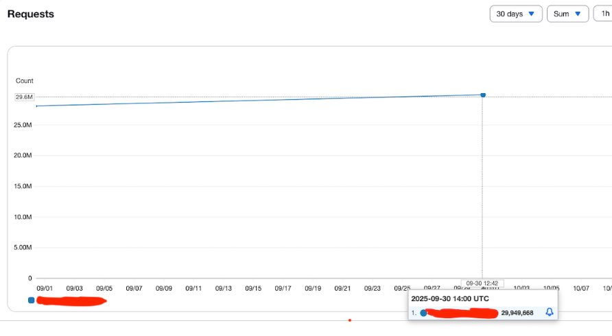
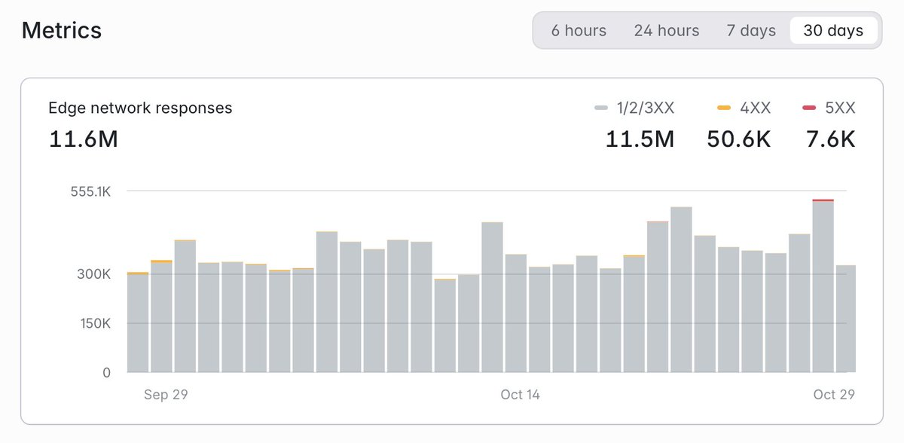
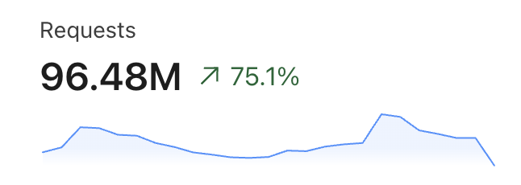

This repository has a goal of spreading the word about real **BIG** projects built with PHP/Laravel. 

I will share what I find online and on social media, you can contribute with links.

---

## Social Media Posts

[Srinath Reddy on X](https://x.com/srinathdudi/status/1983912143457046822): 

> We are currently doing 30M / month on app built using laravel.

---

[John O'Nolan on X](https://x.com/JohnONolan/status/1983600289396748297):

> Doing ~12M req/mo now on my laravel app on Laravel Cloud - which powers [explore.ghost.org](https://explore.ghost.org) (the public front end is very simple, the back end is much more extensive).

---

[Jake Casto on X](https://x.com/0x15f/status/1728172957619617829):

> Almost 100,000,000 reqs in 24 hours and people say Laravel can't scale

---

## More In-Depth Stories/Articles

[Jack Ellis from Fathom Analytics: Does Laravel Scale?](https://usefathom.com/blog/does-laravel-scale)

> Awesome long article, with a conclusion that Laravel is a fantastic choice for 99.99994%+ of web applications.

---

[Mathias Hansen: How Geocodio keeps 300M addresses up to date]()

> The entire platform is built on Laravel and uses Laravel Nova. They also make heavy use of queueing using Laravel Horizon.